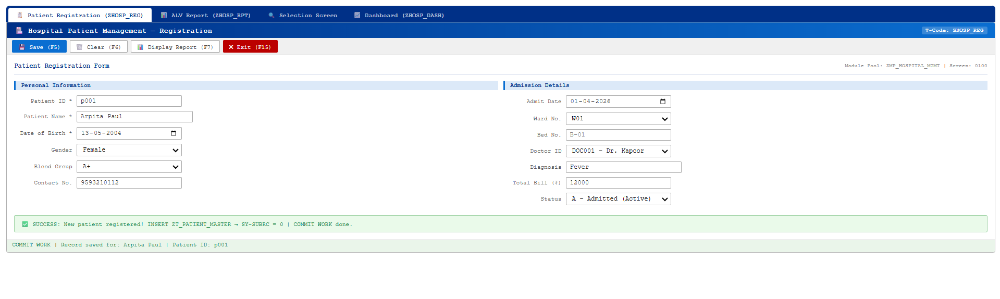
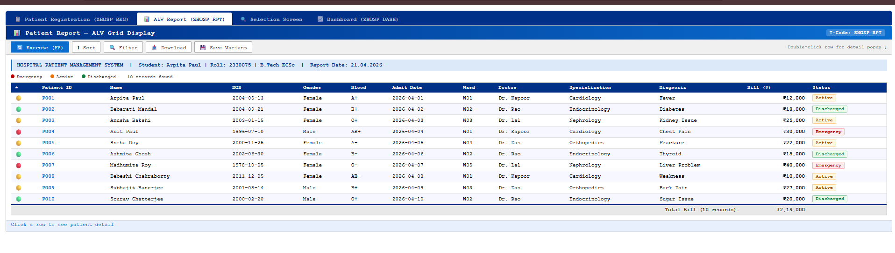
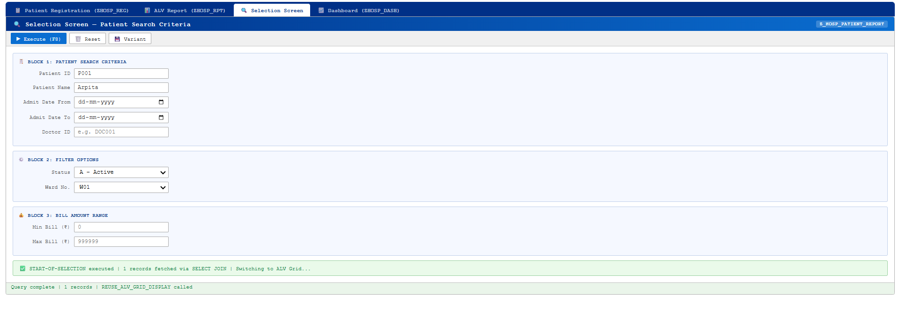
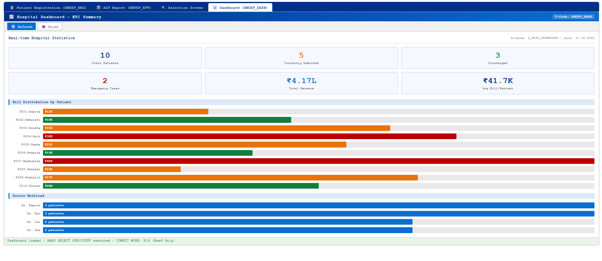

# 🏥 Hospital Management System
## SAP ABAP Module Pool Simulation — Capstone Project

> **A complete simulation of SAP ABAP Hospital Management workflow including Patient Registration, ALV Reporting, Selection Screen filtering, and Dashboard analytics using frontend technologies.**

---

## 📌 Project Overview

The **Hospital Management System** is designed to simulate real-world SAP ABAP Module Pool applications. This project replicates how hospital data is managed in enterprise systems, including patient registration, reporting, filtering, and analytics.

It follows a structured SAP-like workflow where data is entered, processed, displayed, and analyzed through different screens.

---

## 🎯 Problem Statement

Hospitals face challenges such as:

- **Manual patient data handling** leading to errors  
- **Lack of centralized reporting system**  
- **No real-time analytics dashboard**  
- **Difficulty managing patient records efficiently**  

This project solves these problems by implementing a **structured SAP-style digital system**.

---

## 🗂️ Project Structure

---

## ⚙️ System Workflow — 4 Modules

---

## 🔹 Module 1 — Patient Registration

Manage patient records using SAP-like input screen.

| Feature | Description |
|--------|------------|
| Data Entry | Add patient details |
| Validation | Mandatory field checks |
| Update | Modify existing records |
| Status | SAP-style success/error messages |

---

## 🔹 Module 2 — ALV Report

Display patient data in structured table format.

| Feature | Description |
|--------|------------|
| Grid Display | SAP ALV-style table |
| Sorting | Sort by date/fields |
| Filtering | Filter by conditions |
| Total Bill | Auto calculation |

---

## 🔹 Module 3 — Selection Screen

Filter and search patient data dynamically.

| Filter | Description |
|--------|------------|
| Patient Name | Search by name |
| Status | Active / Discharged / Emergency |
| Ward | Ward-based filtering |
| Bill Range | Min/Max amount |

---

## 🔹 Module 4 — Dashboard Analytics

Visual representation of hospital data.

| KPI | Description |
|-----|------------|
| Total Patients | Overall count |
| Active Patients | Currently admitted |
| Discharged | Completed cases |
| Emergency | Critical cases |
| Revenue | Total billing |
| Doctor Load | Patients per doctor |

---

## 📸 Screenshots

### 📝 Registration

### 📊 ALV Report

### 🔍 Selection Screen

### 📈 Dashboard

---

## 🚀 Features

- ✅ SAP GUI-like interface  
- ✅ ALV grid simulation  
- ✅ Dynamic filtering system  
- ✅ Dashboard analytics  
- ✅ Interactive UI  
- ✅ Real-time updates  

---

## 🛠️ Tech Stack

| Layer | Technology |
|------|-----------|
| Frontend | HTML5, CSS3, JavaScript |
| UI Design | SAP GUI Inspired |
| Logic | Vanilla JS |

---

## 🌟 Unique Highlights

1. SAP ABAP Module Pool simulation  
2. ALV-style reporting system  
3. Real-time filtering (Selection Screen)  
4. Dashboard KPI analytics  
5. Fully frontend implementation  
6. Real-world hospital workflow  

---

## 🔮 Future Improvements

| Enhancement | Description |
|------------|------------|
| Database Integration | Store patient data permanently |
| Backend (Node.js / SAP) | Real-time processing |
| Authentication | Login system |
| Mobile UI | Responsive design |

---

## 🌐 Live Demo

👉 https://ArpitaPaul2004.github.io/hospital-management/

---
## 👩‍💻 Author

**Arpita Paul (2330075)**  
B.Tech ECSc | KIIT University  

---
## 📜 Declaration

> This project is an original academic work created to simulate SAP ABAP functionality using frontend technologies.
